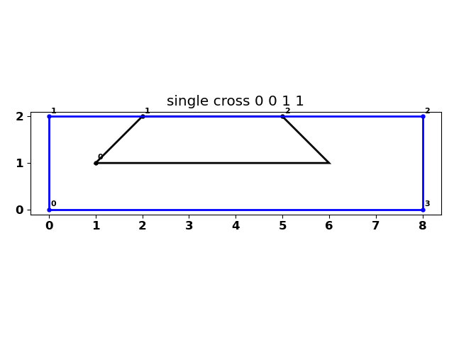
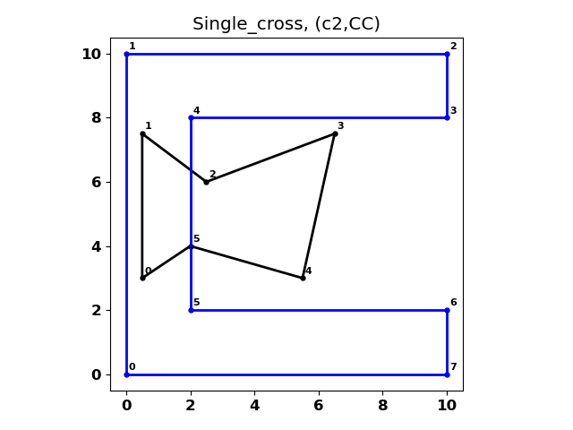

# polygon_clipping
Python, NumPy polygon clipping for concave and convex polygons.

This implementation sets out to determine the intersection (clip) between two polygons.
I employed
- winding numbers to determine which points were inside, outside and on the perimeter of each other.
- from there, intersections were made and those points classified as above.
- the intersection points were simplified to the bare minimum as a crossings array which denotes which segments crossed and hence which points were involved.
  - using a bit of logic, either a clipping segment crosses another segment on the polygon to clip's segment, or at one of its endpoints.
  - a clipping segment can start inside or outside or on the polygon perimeter and they can meet begin/end on polygon vertices.

Enough said, the script can be imported and used with clockwise oriented NumPy arrays.  
I don't cover interior holes, but it could be included by processing the exterior rings first, then reversing the order of interior rings and processing those, combining the results at the end.  I didn't since it was more of venture of finding out where this worked and where logic failed.  As such, I will make notes of changes that I make as I test more polygon arrangements.

**Initial Post**
- 2022-02-23

  
  

This single cross has the intersection points at the vertices of a line segment.  

In this example, only one vertex is meets an intersection point.  

<!--  -->

