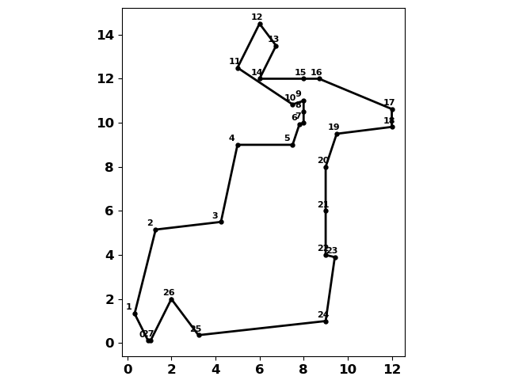

# Polygon Clipping

**Python, NumPy polygon clipping for concave and convex polygons.**

Source code is part of numpy_geometry... `npg`.

[Polygon clipping source code.](https://github.com/Dan-Patterson/numpy_geometry/blob/master/arcpro_npg/npg/npg/old/npg_boolean.py)

[Clipping discussion and example.](https://github.com/Dan-Patterson/geonumeracy/blob/main/docs/clipping/clip.md)

This implementation sets out to determine the intersection (clip) between two polygons.
I employed
- winding numbers to determine which points were inside, outside and on the perimeter of each other.
- from there, intersections were made and those points classified as above.
- the intersection points were simplified to the bare minimum as a crossings array which denotes which segments crossed and hence which points were involved.
  - using a bit of logic, either a clipping segment crosses another segment on the polygon to clip's segment, or at one of its endpoints.
  - a clipping segment can start inside or outside or on the polygon perimeter and they can meet begin/end on polygon vertices.

Enough said, the script can be imported and used with clockwise oriented NumPy arrays.  
I don't cover interior holes, but it could be included by processing the exterior rings first, then reversing the order of interior rings and processing those, combining the results at the end.  I didn't since it was more of venture of finding out where this worked and where logic failed.  As such, I will make notes of changes that I make as I test more polygon arrangements.


**Last edit ...**
- 2022-11-27

<!--The image ... <a href="url"></a> <br clear="all"> -->
<p>

|      single cross examples|  |
| ------------ | -------- |
|  |  |
| Clip segments meet on polygon, no intersections at vertices.| Clip result. |
|  |  |
| Clip segments cross over polygon segments, no intersections at vertices.| Clip result. |
|  |  |
| Multiple clip segments cross over polygon segments, no intersections at vertices.| Clip result. |
|  |  |
| A single vertex meets an intersection point.  |  Clip result. |
|  |  |
| First clip vertex meets polygon vertex, two others on line.  |  Clip result.|
|  |  |
| More  |  Clip result.|
|  |  |
| More  |  Clip result.|
|  |  |
| More  |  Clip result.|


|      complex polygon examples|  |
| ------------ | -------- |
|  |  |

The blue polygon is the clipping polygon and the black one is the polygon being clipped.


| another concave example|   |
| ------------ | -------- |
|  |  |
| Input polygon  |  Clipping polygon|
|  |  |
| More  |  Clip result.|

| Annotated result|
|  |
|  |
| More  |

**Continue tomorrow**

**new_**
**xChk**
**x0x1**
**p_in_c**
**c_in_p**


```python

new_, tot_, xChk, x0x1, p_in_c, c_in_p = clip(pl, cl)

# -- intersection point pairs
x0x1
[array([[  0.95,   0.11],
        [  0.33,   1.33]]),
 array([[  1.29,   5.15],
        [  5.00,   9.00]]),
 array([[  7.81,   9.94],
        [  8.00,  10.50]]),
 array([[  7.50,  10.83],
        [  5.00,  12.50]]),
 array([[  6.00,  14.50],
        [  6.75,  13.50]]),
 array([[  8.70,  12.00],
        [ 12.00,  10.62]]),
 array([[ 12.00,   9.81],
        [  9.41,   3.90]]),
 array([[  9.00,   1.00],
        [  3.23,   0.36]]),
 array([[  1.06,   0.12],
        [   nan,    nan]])]

# -- polygon points in clipper, clipper points in polygon

p_in_c  # [2, 3, 8, 9, 13]
c_in_p  # [3, 4, 5, 6, 7, 8, 11, 12, 13, 14, 18, 20]

# -- xChk output
xChk
array([[ 0,  0,  0, 13,  0,  0,  0,  1],
       [ 2,  3,  0,  1,  0,  1,  0,  0],
       [ 5,  5,  1,  2,  1,  1,  0,  1],
       [ 6,  6,  3,  5,  1,  1,  1,  0],
       [ 7,  8,  6,  7,  1,  1,  0,  0],
       [ 9,  9,  9, 10,  0,  0,  1,  0],
       [10, 14, 10, 12,  0,  1,  0,  0],
       [17, 19, 12, 13,  0,  0,  0,  1],
       [20, -1, 13, -1,  1,  0,  1,  0]], dtype=int64)
 
 # -- script output
0 x0,x1  [  0.95   0.11], [  0.33   1.33]
  xC     [ 0  0  0 13  0  0  0  1]
  c0c1_, p0p1_:   0 0 0 1
  bfc:bfp []  []
  btc:btp []  [2, 3]
  sub :  []

1 x0,x1  [  1.29   5.15], [  5.00   9.00]
  xC     [2 3 0 1 0 1 0 0]
  c0c1_, p0p1_:   0 1 0 0
  bfc:bfp []  []
  btc:btp [3]  []
  sub :  []

2 x0,x1  [  7.81   9.94], [  8.00  10.50]
  xC     [5 5 1 2 1 1 0 1]
  c0c1_, p0p1_:   1 1 0 1
  bfc:bfp [4, 5]  []
  btc:btp []  []
  sub :  [array([  5.00,   9.00]), array([  7.50,   9.00])]

3 x0,x1  [  7.50  10.83], [  5.00  12.50]
  xC     [6 6 3 5 1 1 1 0]
  c0c1_, p0p1_:   1 1 1 0
  bfc:bfp []  []
  btc:btp []  []
  sub :  []

4 x0,x1  [  6.00  14.50], [  6.75  13.50]
  xC     [7 8 6 7 1 1 0 0]
  c0c1_, p0p1_:   1 1 0 0
  bfc:bfp []  []
  btc:btp [7, 8]  []
  sub :  []

5 x0,x1  [  8.70  12.00], [ 12.00  10.62]
  xC     [ 9  9  9 10  0  0  1  0]
  c0c1_, p0p1_:   0 0 1 0
  bfc:bfp []  [8, 9]
  btc:btp []  []
  sub :  [array([  6.00,  12.00]), array([  8.00,  12.00])]

6 x0,x1  [ 12.00   9.81], [  9.41   3.90]
  xC     [10 14 10 12  0  1  0  0]
  c0c1_, p0p1_:   0 1 0 0
  bfc:bfp []  []
  btc:btp [11, 12, 13, 14]  []
  sub :  []

7 x0,x1  [  9.00   1.00], [  3.23   0.36]
  xC     [17 19 12 13  0  0  0  1]
  c0c1_, p0p1_:   0 0 0 1
  bfc:bfp []  []
  btc:btp [18]  []
  sub :  []
``

</p>
<br clear="right">


<!-- <a href="url"></a> -->
