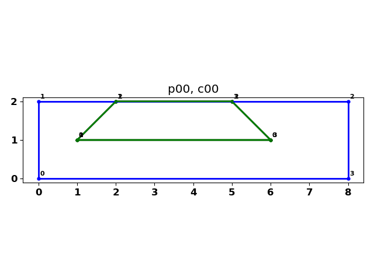

# Polygon Clipping

**Python, NumPy polygon clipping for concave and convex polygons.**

Source code is part of numpy_geometry... `npg`.

[Polygon clipping source code.](https://github.com/Dan-Patterson/numpy_geometry/blob/master/arcpro_npg/npg/npg/npg_clip.py)

[Clipping discussion and example.](https://github.com/Dan-Patterson/geonumeracy/blob/main/docs/clipping/clip.md)

This implementation sets out to determine the intersection (clip) between two polygons.
I employed
- winding numbers to determine which points were inside, outside and on the perimeter of each other.
- from there, intersections were made and those points classified as above.
- the intersection points were simplified to the bare minimum as a crossings array which denotes which segments crossed and hence which points were involved.
  - using a bit of logic, either a clipping segment crosses another segment on the polygon to clip's segment, or at one of its endpoints.
  - a clipping segment can start inside or outside or on the polygon perimeter and they can meet begin/end on polygon vertices.

Enough said, the script can be imported and used with clockwise oriented NumPy arrays.  
I don't cover interior holes, but it could be included by processing the exterior rings first, then reversing the order of interior rings and processing those, combining the results at the end.  I didn't since it was more of venture of finding out where this worked and where logic failed.  As such, I will make notes of changes that I make as I test more polygon arrangements.

**Last edit ...**
- 2022-11-27

<!--The image ...    -->

|      single cross examples|  |
| ------------ | -------- |
|  |  |
| Clip segments meet on polygon, no intersections at vertices.| Clip result. |
|  |  |
| Clip segments cross over polygon segments, no intersections at vertices.| Clip result. |
|  |  |
| Multiple clip segments cross over polygon segments, no intersections at vertices.| Clip result. |
|  |  |
| A single vertex meets an intersection point.  |  Clip result. |
|  |  |
| First clip vertex meets polygon vertex, two others on line.  |  Clip result.|
|  |  |
| More  |  Clip result.|
|  |  |
| More  |  Clip result.|
|  |  |
| More  |  Clip result.|

|      complex polygon examples|  |
| ------------ | -------- |
|  |  |

The blue polygon is the clipping polygon and the black one is the polygon being clipped.

| another concave example|   |
| ------------ | -------- |
|  |  |
| Input polygon  |  Clipping polygon|
|  |  |
| More  |  Clip result.|

| Annotated result|
|  |
| More  |

 

<!--  -->
